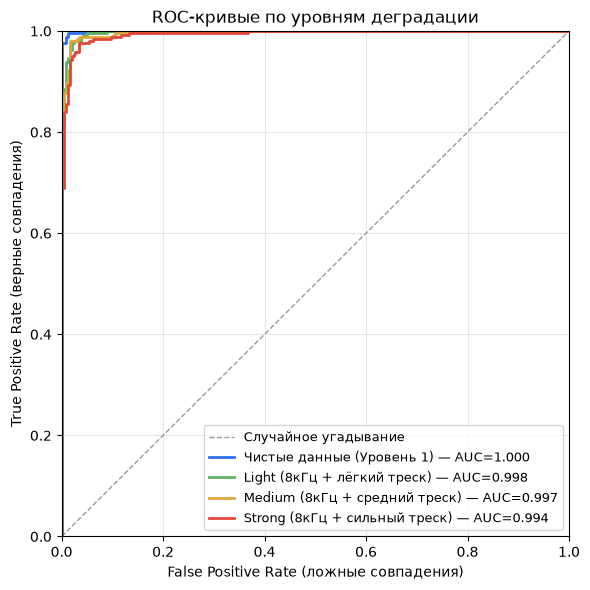
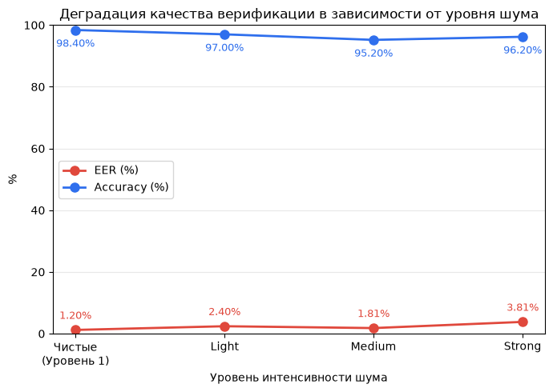
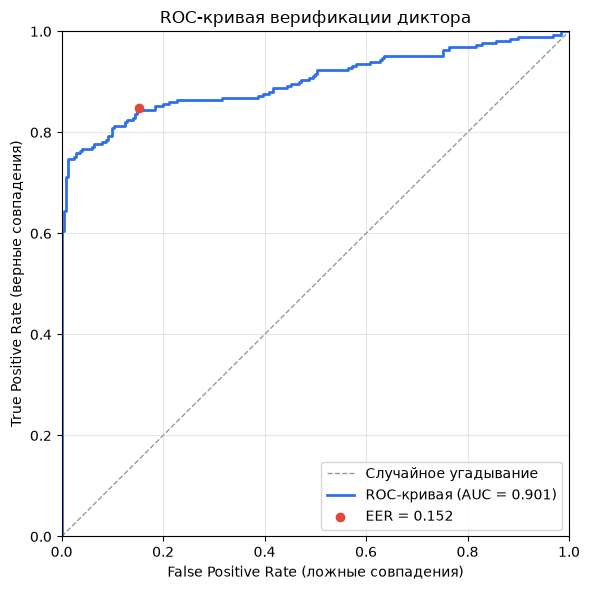

# Верификация диктора

Сервис сравнивает два аудиофайла и определяет, принадлежат ли они одному и тому же
голосу. Модель ECAPA-TDNN (`speechbrain/spkrec-ecapa-voxceleb`), интерфейс на Gradio
(`app.py`). Валидация находится в файле `validation.ipynb`.

## Что было сделано

1. **Baseline sanity check.** Пайплайн верификации оценён на репрезентативной выборке
   размеченных пар VoxCeleb1-O (чистые студийные записи, 16 кГц); полученный EER сверен с
   опубликованным бенчмарком ECAPA-TDNN, это подтвердило корректность модели и
   препроцессинга перед переходом к анализу деградации.
2. **Симуляция целевых условий эксплуатации.** На тех же парах применена контролируемая
   деградация сигнала: понижение частоты дискретизации до 8 кГц и синтетический
   шум трёх уровней интенсивности (light/medium/strong). Измерены EER и AUC на каждом
   уровне, чтобы оценить устойчивость модели к росту шума.
3. **Калибровка порога принятия решения.** `threshold` по косинусному расстоянию подобран
   не под один сценарий шума, а на смешанном пуле из чистых и зашумлённых пар в равной
   пропорции, так порог остаётся сбалансированным по всему ожидаемому диапазону условий
   инференса, а не переобучается под конкретный уровень деградации.
4. **Проверка обобщаемости на независимом датасете.** Откалиброванный порог прогнан на
   CN-Celeb, датасете с естественным (не синтетическим) шумом и записями на другом языке
   (китайский), чтобы оценить, насколько результаты этапов 1–3 переносятся на данные,
   которые модель никогда не видела, и не переобучена ли калибровка под конкретный вид
   тестового шума.

## Установка и запуск

```bash
python3 -m venv ".venv"
source .venv/bin/activate
pip install -r requirements.txt
python3 app.py
```

## Структура проекта

```
app.py                  # Gradio-сервис верификации
validation.ipynb        # Полная валидация (Уровни 1-4)
requirements.txt
pretrained_models/      # веса ECAPA-TDNN (в репозитории)
data/                   # VoxCeleb1 (не в репозитории, см. ноутбук)
CN-Celeb_flac/           # CN-Celeb (не в репозитории)
```

## Воспроизводимость validation.ipynb

Датасеты в репозиторий не входят, для запуска ноутбука их нужно скачать отдельно:

**VoxCeleb1** — https://www.kaggle.com/datasets/aryagokh/voxceleb-1-dataset
1. Скачать папку `vox1_test_wav` и переименовать её в `voxceleb1`.
2. Скачать файл `veri_test2.txt`.
3. Создать папку `data/` в корне проекта и положить туда `voxceleb1/` и `veri_test2.txt`.

**CN-Celeb** — https://www.openslr.org/82/
1. Скачать `cn-celeb_v2.tar.gz` и распаковать.
2. Положить папку `CN-Celeb_flac/` в корень репозитория.

## Методология валидации

| Этап | Что делали |
|---|---|
| 1. Baseline | EER на чистых парах VoxCeleb1-O (`veri_test2.txt`), sanity check пайплайна |
| 2. Деградация | Downsample 16→8кГц + синтетический треск (light/medium/strong) на тех же парах |
| 3. Калибровка threshold | EER на смешанном пуле (250 clean + 250 light + 250 medium + 250 strong) |
| 4. Обобщаемость | Проверка откалиброванного threshold на CN-Celeb (реальный шум, out-of-distribution) |

## Результаты

| Уровень | EER | AUC |
|---|---|---|
| Чистые (VoxCeleb1) | 1.20% | 0.9996 |
| Light (8кГц + лёгкий треск) | 2.40% | 0.9976 |
| Medium (8кГц + средний треск) | 1.81% | 0.9966 |
| Strong (8кГц + сильный треск) | 3.81% | 0.9937 |
| **CN-Celeb (out-of-distribution)** | **15.20%** | **0.9014** |

**Итоговый threshold: `0.3088`** (откалиброван на смешанном пуле, Этап 3, используется в `app.py`).
Его эффективность подтверждается и на out-of-distribution датасете: на CN-Celeb он даёт
accuracy 84.6% против 83.0% у дефолтного threshold=0.25, то есть порог не переобучен под
VoxCeleb и синтетический шум, а обобщается лучше даже на незнакомых данных.

#### ROC-кривые по уровням шума (VoxCeleb1)

Сравнение разделимости классов SAME/DIFFERENT на чистых данных и трёх уровнях синтетической деградации.



#### Кривая деградации: EER и Accuracy в зависимости от уровня шума

Как растут ошибки верификации по мере усиления деградации сигнала, от чистых записей до сильного шума.



#### ROC-кривая на CN-Celeb (out-of-distribution)

Разделимость классов на независимом датасете с естественным шумом, проверка обобщаемости модели.



## Выводы

- Модель устойчива к синтетической деградации (даунсемпл + треск), EER растёт умеренно,
  AUC остаётся выше 0.99 даже при сильном шуме.
- **Резкое падение качества на CN-Celeb** (EER 15.2% против 1.2% на чистом VoxCeleb).
  Реальный шум ощутимо сложнее для модели, чем наша синтетическая имитация.
  Учитывая иную природу аудиофайлов (китайский язык), модель показывает себя робастно.
- Дообучение на новых данных было решено не делать по причине: ECAPA-TDNN обучен на VoxCeleb1+2, то есть на сотнях тысяч примеров, тысячах дикторов. Дообучение на несопоставимо малом количестве синтетически зашумлённых пар (сотни–тысячи) с высокой вероятностью приведёт к переобучению под конкретный синтетический шум, а не к реальному улучшению устойчивости. 
