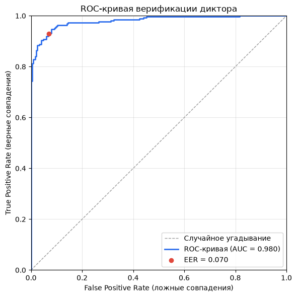
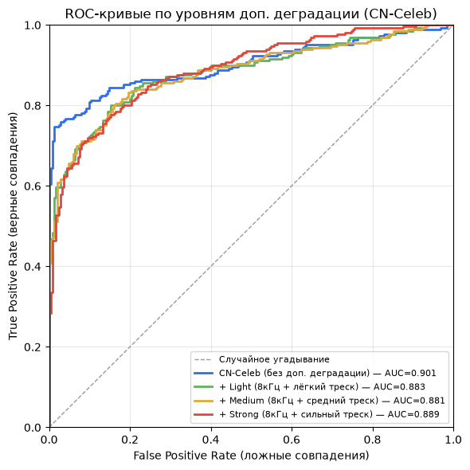
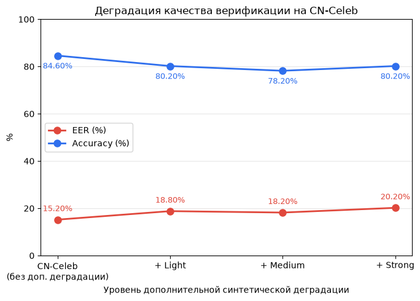
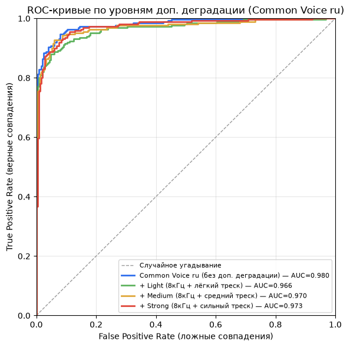
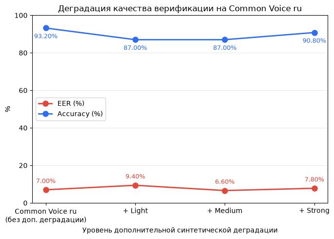

# Верификация диктора

Сервис сравнивает два аудиофайла и определяет, принадлежат ли они одному и тому же
голосу. Модель ECAPA-TDNN (`speechbrain/spkrec-ecapa-voxceleb`), интерфейс на Gradio
(`app.py`). Валидация находится в файле `validation.ipynb`.

## Что было сделано

1. **Baseline проверка.** Пайплайн верификации оценён на репрезентативной выборке
   размеченных пар VoxCeleb1-O (чистые студийные записи, 16 кГц); полученный EER сверен с
   опубликованным бенчмарком ECAPA-TDNN, это подтвердило корректность модели и
   препроцессинга перед переходом к анализу деградации.
2. **Симуляция целевых условий эксплуатации.** На тех же парах применена контролируемая
   деградация сигнала: понижение частоты дискретизации до 8 кГц и синтетический
   шум трёх уровней интенсивности (light/medium/strong). Измерены EER и AUC на каждом
   уровне, чтобы оценить устойчивость модели к росту шума.
3. **Калибровка порога принятия решения.** `threshold` по косинусному расстоянию подобран
   не под один сценарий шума, а на смешанном пуле из чистых и зашумлённых пар в равной
   пропорции, так порог остаётся сбалансированным по всему ожидаемому диапазону условий
   инференса, а не переобучается под конкретный уровень деградации.
4. **Проверка обобщаемости на независимом датасете.** Откалиброванный порог прогнан на
   CN-Celeb, датасете с естественным (не синтетическим) шумом и записями на другом языке
   (китайский), чтобы оценить, насколько результаты этапов 1–3 переносятся на данные,
   которые модель никогда не видела, и не переобучена ли калибровка под конкретный вид
   тестового шума.
5. **Проверка обобщаемости на русской речи.** Откалиброванный порог дополнительно прогнан
   на Common Voice ru — пары SAME/DIFFERENT сформированы вручную по `client_id`, т.к. датасет
   размечен для ASR, а не для верификации диктора. Проверяет обобщаемость и на языке, и на
   типе записи (пользовательские mp3 вместо студийных wav).
6. **Комбинированная деградация на OOD-датасетах.** Тот же пайплайн шума из Этапа 2 (downsample
   + треск light/medium/strong) применён поверх пар CN-Celeb и Common Voice ru — оба датасета
   уже содержат естественный шум, интересно, компаундируется ли с ним синтетическая деградация
   так же, как на чистом VoxCeleb, или модель уже "на потолке" деградации.

## Установка и запуск

```bash
python3 -m venv ".venv"
source .venv/bin/activate
pip install -r requirements.txt
python3 app.py
```

## Структура проекта

```
app.py                          # Gradio-сервис верификации
validation.ipynb                # Полная валидация (этапы 1-5)
requirements.txt
pretrained_models/              # веса ECAPA-TDNN (в репозитории)
data/                           # VoxCeleb1 (не в репозитории, см. ноутбук)
CN-Celeb_flac/                  # CN-Celeb (не в репозитории)
cv-corpus-26.0-2026-06-12/      # Common Voice ru (не в репозитории)
```

## Воспроизводимость validation.ipynb

Датасеты в репозиторий не входят, для запуска ноутбука их нужно скачать отдельно:

**VoxCeleb1** — https://www.kaggle.com/datasets/aryagokh/voxceleb-1-dataset
1. Скачать папку `vox1_test_wav` и переименовать её в `voxceleb1`.
2. Скачать файл `veri_test2.txt`.
3. Создать папку `data/` в корне проекта и положить туда `voxceleb1/` и `veri_test2.txt`.

**CN-Celeb** — https://www.openslr.org/82/
1. Скачать `cn-celeb_v2.tar.gz` и распаковать.
2. Положить папку `CN-Celeb_flac/` в корень репозитория.

**Common Voice ru** — https://mozilladatacollective.com/datasets/cmqinj9g500vsnr07qf4hmr3j
1. Скачать корпус и распаковать.
2. Положить папку `cv-corpus-26.0-2026-06-12/` в корень репозитория.

## Методология валидации

| Этап | Что делали |
|---|---|
| 1. Baseline | EER на чистых парах VoxCeleb1-O (`veri_test2.txt`), базовая проверка пайплайна |
| 2. Деградация | Downsample 16→8кГц + синтетический треск (light/medium/strong) на тех же парах |
| 3. Калибровка threshold | EER на смешанном пуле (250 clean + 250 light + 250 medium + 250 strong) |
| 4. Обобщаемость (CN-Celeb) | Проверка threshold на CN-Celeb (реальный шум, другой язык, out-of-distribution) |
| 5. Обобщаемость (RU) | Проверка threshold на Common Voice ru (реальный шум, русский язык, out-of-distribution) |
| 6. Комбинированная деградация | Downsample + треск (light/medium/strong) поверх CN-Celeb и Common Voice ru |

## Результаты

| Уровень | EER | ROC-AUC |
|---|---|---|
| Чистые (VoxCeleb1) | 1.20% | 0.9996 |
| Light (8кГц + лёгкий треск) | 2.40% | 0.9976 |
| Medium (8кГц + средний треск) | 1.81% | 0.9966 |
| Strong (8кГц + сильный треск) | 3.81% | 0.9937 |
| CN-Celeb (out-of-distribution) | 15.20% | 0.9014 |
| **Common Voice ru (out-of-distribution)** | **7.00%** | **0.9798** |

**Итоговый threshold: `0.3088`** (откалиброван на смешанном пуле, Этап 3, используется в `app.py`).
Его эффективность подтверждается на обоих out-of-distribution датасетах:

| Датасет | Accuracy при threshold=0.25 (дефолт) | Accuracy при threshold=0.3088 (откалиброван) |
|---|---|---|
| CN-Celeb | 83.0% | 84.6% |
| Common Voice ru | 91.2% | 93.2% |

Порог не переобучен под VoxCeleb и синтетический шум — он обобщается лучше дефолтного и на
незнакомом языке/типе шума, и на пользовательских записях на русском.

#### ROC-кривые по уровням шума (VoxCeleb1)

Сравнение разделимости классов SAME/DIFFERENT на чистых данных и трёх уровнях синтетической деградации.


#### Кривая деградации: EER и Accuracy в зависимости от уровня шума

Как растут ошибки верификации по мере усиления деградации сигнала, от чистых записей до сильного шума.


#### ROC-кривая на CN-Celeb (out-of-distribution)

Разделимость классов на независимом датасете с естественным шумом, проверка обобщаемости модели.


#### ROC-кривая на Common Voice ru (out-of-distribution)

Разделимость классов на пользовательских mp3-записях русской речи — проверка обобщаемости
на другом языке и другом типе аудио (не студийная запись).



### Комбинированная деградация на OOD-датасетах

Тот же пайплайн деградации (downsample до 8кГц + синтетический треск light/medium/strong), что и
в Этапе 2, применён поверх уже "полевых" (не студийных) записей CN-Celeb и Common Voice ru.

**CN-Celeb:**

| Уровень | EER | Accuracy |
|---|---|---|
| Без доп. деградации | 15.20% | 84.60% |
| + Light | 18.80% | 80.20% |
| + Medium | 18.20% | 78.20% |
| + Strong | 20.20% | 80.20% |

**Common Voice ru:**

| Уровень | EER | Accuracy |
|---|---|---|
| Без доп. деградации | 7.00% | 93.20% |
| + Light | 9.40% | 87.00% |
| + Medium | 6.60% | 87.00% |
| + Strong | 7.80% | 90.80% |

#### ROC-кривые по уровням доп. деградации (CN-Celeb)



#### Кривая деградации на CN-Celeb



#### ROC-кривые по уровням доп. деградации (Common Voice ru)



#### Кривая деградации на Common Voice ru



## Выводы

- Модель устойчива к синтетической деградации (даунсемпл + треск), EER растёт умеренно,
  AUC остаётся выше 0.99 даже при сильном шуме.
- **Падение качества на out-of-distribution датасетах**, но в разной степени: на CN-Celeb
  (EER 15.2%) заметно сильнее, чем на Common Voice ru (EER 7.0%), при том что оба против
  1.2% на чистом VoxCeleb. Реальный шум и смена языка/типа записи сложнее для модели, чем
  наша синтетическая имитация, но не критично — ROC-AUC остаётся выше 0.9 на обоих датасетах,
  а EER намного лучше случайного угадывания.
- **Откалиброванный threshold обобщается лучше дефолтного на обоих датасетах** (CN-Celeb:
  84.6% vs 83.0% accuracy; Common Voice ru: 93.2% vs 91.2%) — калибровка на смешанном пуле
  VoxCeleb не переобучена под конкретный язык или тип шума.
- **На CN-Celeb доп. деградация добавляет ещё +3–5 п.п. к EER поверх и так высокого базового уровня
  (15.2% → 18–20%)**: эффект сильнее, чем на чистом VoxCeleb (+0.6–2.6 п.п.). На Common Voice ru EER-кривая по
  уровням шума снова немонотонна (light 9.4% > strong 7.8%), как и на VoxCeleb (Этап 2) — на
  выборках по 250 пар на класс это, вероятнее всего, статистический шум точечной EER-оценки,
  а не реальное улучшение при более сильной деградации.
- Дообучение на новых данных было решено не делать по причине: ECAPA-TDNN обучена на VoxCeleb1+2: 
   сотнях тысяч примеров и тысячах дикторов (мультиязычных). Дообучение на несопоставимо малом 
   количестве синтетически зашумлённых пар с высокой вероятностью приведёт к переобучению под 
   конкретный синтетический шум, а не к реальному улучшению устойчивости.
